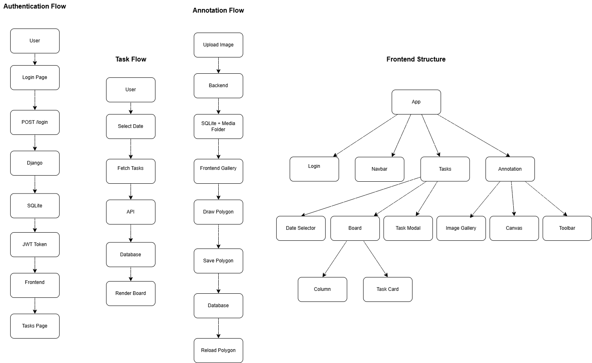

# System Architecture

## Overview

---

## Explanation

The application follows a client-server architecture.

- Frontend built with React + TypeScript
- Backend built with Django REST Framework
- SQLite stores relational data
- Images are stored in the media directory
- JWT is used for authentication