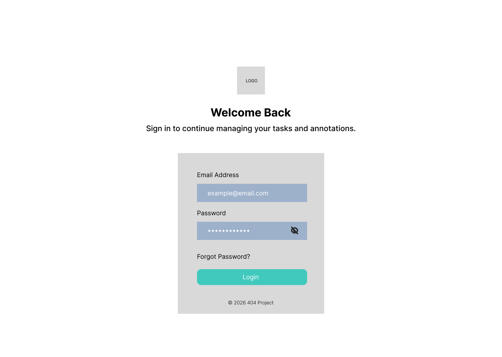
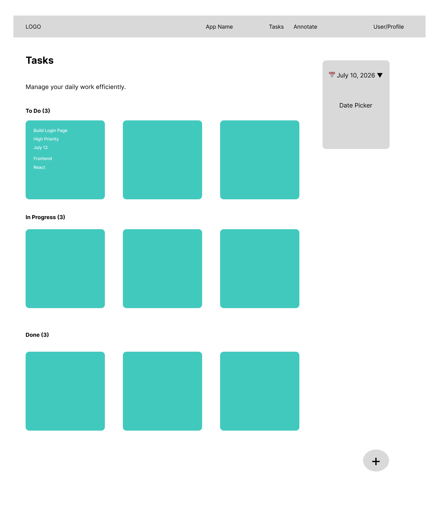
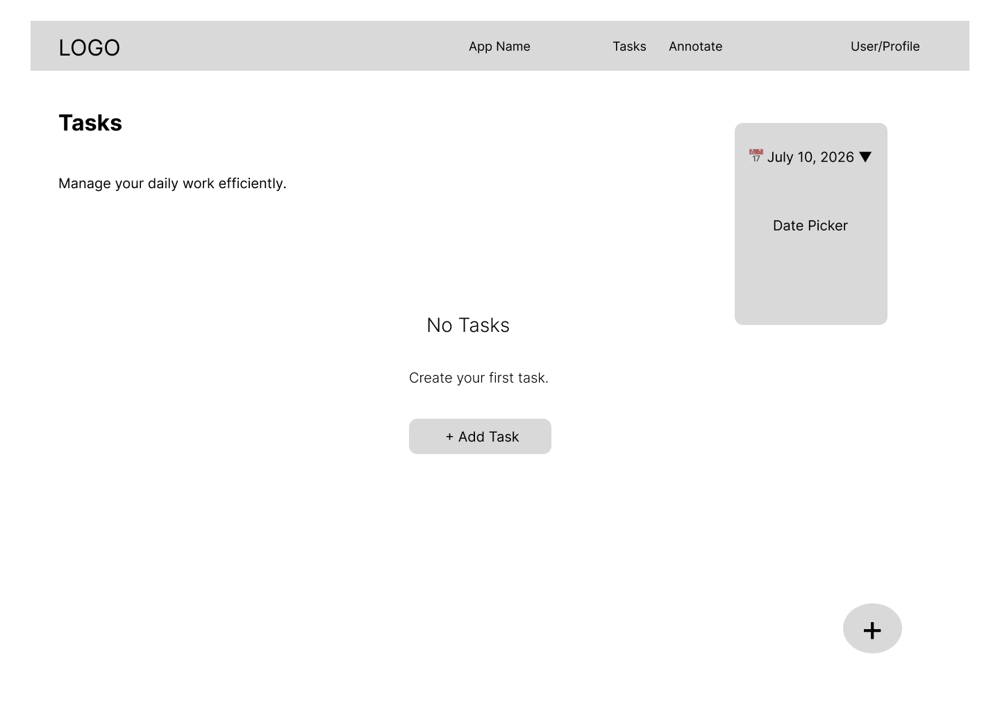
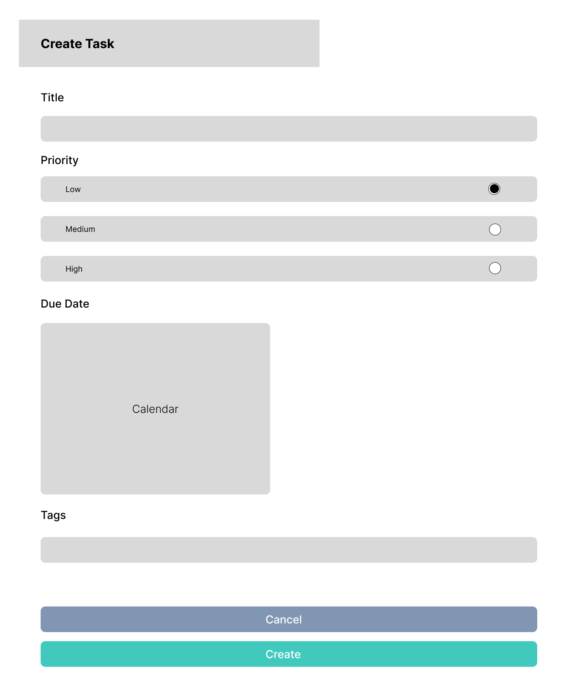
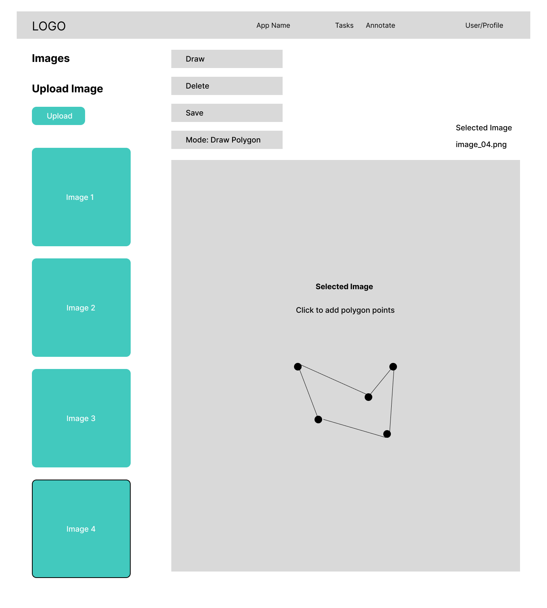
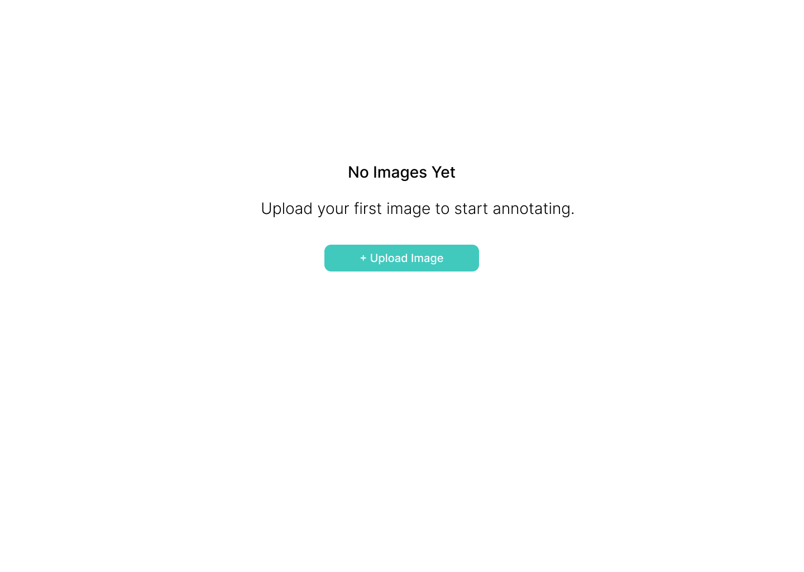

# UI Sketches

## Overview

The following wireframes represent the initial UI planning for the application. The focus is on layout, user flow, and component placement rather than colors or visual styling.

---

# 1. Login Page

### Purpose

Allows users to authenticate using their email and password before accessing the application.

### Components

- App Logo
- Welcome Heading
- Email Input
- Password Input
- Login Button

---

# 2. Tasks Page

### Purpose

Provides a Kanban board for managing daily tasks based on the selected date.

### Components

- Navbar
- Page Header
- Date Selector
- Kanban Board
- Three Columns (To Do, In Progress, Done)
- Task Cards
- Floating "Add Task" Button

### User Actions

- Select a date
- View tasks
- Drag tasks between columns
- Open task modal
- Edit existing tasks
- Delete tasks

---

# 3. Tasks Page – Empty State

### Purpose

Displayed when no tasks exist for the selected date.

### Components

- Empty State Illustration / Message
- "No Tasks Found" Text
- Add Task Button

### User Action

- Create the first task for the selected date.

---

# 4. Task Modal

### Purpose

Allows users to create or edit a task.

### Components

- Title Input
- Priority Selector
- Due Date Picker
- Tags Input
- Cancel Button
- Create / Save Button

### User Actions

- Create a task
- Edit a task
- Cancel changes

---

# 5. Annotation Page

### Purpose

Allows users to upload images, browse uploaded images, draw polygon annotations, and save them.

### Components

- Navbar
- Image Sidebar
- Upload Image Button
- Image Thumbnails
- Toolbar
  - Draw Polygon
  - Delete Polygon
  - Save
- Image Canvas
- Polygon Layer

### User Actions

- Upload an image
- Select an image
- Draw polygon annotations
- Delete polygons
- Save annotations

---

# 6. Annotation – Empty State

### Purpose

Displayed when no images have been uploaded.

### Components

- Empty State Message
- Upload Image Button

### User Action

- Upload the first image to begin annotating.

---

# Design Goals

The wireframes were designed with the following principles in mind:

- Clean and minimal interface
- Modular component structure
- Easy navigation between pages
- Large workspace for task management and image annotation
- Responsive layout suitable for desktop, tablet, and mobile devices
- Consistent spacing and reusable UI components